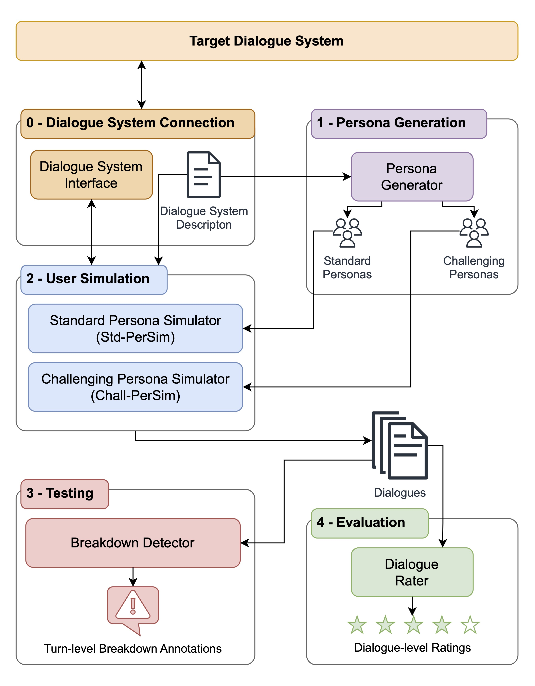

<p align="center">
 <h1 align="center"> ChatChecker - Automatic Dialogue System Testing and Evaluation</h1>
</p>

ChatChecker is an LLM-based framework for the automatic testing of dialogue systems including user simulation, breakdown detection, and automatic evaluation.

<p align="center">

</p>


## 📑 Table of Contents
- [📑 Table of Contents](#-table-of-contents)
- [🛠️ Setup](#️-setup)
  - [📦 Installation](#-installation)
    - [Option 1: Install from GitHub](#option-1-install-from-github)
    - [Option 2: Install from Source](#option-2-install-from-source)
  - [⚙️ Configure Environment Variables](#️-configure-environment-variables)
- [🚀 Usage](#-usage)
  - [💻 CLI](#-cli)
  - [🎯 Initial Setup For Each Target Chatbot](#-initial-setup-for-each-target-chatbot)
  - [📝 Basic Usage](#-basic-usage)
- [👨‍💻 Development](#-development)
  - [📥 Install Using Poetry](#-install-using-poetry)
  - [🔧 Install Pre-commit Hooks](#-install-pre-commit-hooks)
  - [✅ Run Type-Checking](#-run-type-checking)
  - [🔍 Run Linting](#-run-linting)
  - [✨ Run Formatting](#-run-formatting)
- [📄 License](#-license)

## 🛠️ Setup
### 📦 Installation
🚧 Installation from PyPi will be available in the future.

#### Option 1: Install from GitHub
```bash
pip install -U git+https://github.com:chat-checker-coder/chat-checker-anon.git
```

#### Option 2: Install from Source
1. Clone the repository:
```bash
git clone https://github.com:chat-checker-coder/chat-checker-anon.git
cd chat-checker
```

2. Install using pip:
```bash
pip install -e .
```

### ⚙️ Configure Environment Variables
Set the environment variables described in `.env.example` in your system.

## 🚀 Usage

### 💻 CLI
Run `chat-checker --help` to see available commands:

Example output:
```

 Usage: chat-checker [OPTIONS] COMMAND [ARGS]...

 chat-checker CLI for chatbot testing and evaluation


╭─ Options ──────────────────────────────────────────────────────────────────────────────────────────────────────────────────────────────────────────────────╮
│ --install-completion          Install completion for the current shell.                                                                                    │
│ --show-completion             Show completion for the current shell, to copy it or customize the installation.                                             │
│ --help                        Show this message and exit.                                                                                                  │
╰────────────────────────────────────────────────────────────────────────────────────────────────────────────────────────────────────────────────────────────╯
╭─ Commands ─────────────────────────────────────────────────────────────────────────────────────────────────────────────────────────────────────────────────╮
│ register            Register chatbots contained in the base directory for testing and evaluation.                                                          │
│ generate-personas   Generate user personas for chatbot simulation.                                                                                         │
│ simulate-users      Simulate users interacting with a chatbot.                                                                                             │
│ test                Run tests to spot errors in dialogues from a previous run.                                                                             │
│ evaluate            Evaluate dialogues from a previous run.                                                                                                │
│ run                 Run the full pipeline: simulate users, spot errors, and evaluate dialogues.                                                            │
╰────────────────────────────────────────────────────────────────────────────────────────────────────────────────────────────────────────────────────────────╯

```

### 🎯 Initial Setup For Each Target Chatbot
1. Configure your chatbot:
   1. Create a subdirectory `<id_of_your_chatbot>` for your chatbot in a `<your_chatbots_directory>` directory and add an empty `__init__.py` file.
   2. Add a `chatbot_client.py` file that implements the [`ChatbotClientInterface`](chat_checker/chatbot_connection/chatbot_client_base.py) for interacting with your chatbot.
   3. Add a `config.yaml` file with the following content:
      ```yaml
      chatbot_id: my_chatbot  # Unique identifier for your chatbot
      chatbot_info:
        name: My Chatbot
        description: A helpful chatbot that...  # Brief user-facing description
        interaction_method: text-based  # How to interact (text-based, voice, etc.)
        type: task-oriented         # Type of chatbot (task-oriented or conversational)
        task: The chatbot should ...  # Structured description of the chatbot's task
        constraints:          # Any limitations
          - Should not provide medical advice
          - Should redirect if ...
        known_limitations:    # Known issues
          - Cannot ...
        available_languages:  # Supported languages
          - English
        user_simulation_config:
          typical_user_turn_length: "10 words"  # Expected turn length
          max_user_turn_length: "40 words"     # Soft constraint for turn length
          max_user_turns: 10            # Maximum conversation length
      ```
2. Register your chatbot: `chat-checker register -d <your_chatbots_directory>`
3. Optional: generate user personas for your chatbot: `chat-checker generate-personas <chatbot_id> -t <persona_type> -n <num_personas>`. Or manually add yaml files representing personas to the `user_personas` directory.

### 📝 Basic Usage
1. Make sure your chatbot is running and accessible via the chatbot client.
2. Simulate a chat with your chatbot: `chat-checker simulate-users <chatbot_id> -u <user_type> -sel <persona_selection>`
3. Test the simulated dialogues for breakdowns: `chat-checker test <chatbot_id> <run_id>`
4. Evaluate the simulated dialogues: `chat-checker evaluate <chatbot_id> <run_id>`
5. View the results in your `<your_chatbots_directory>/<chatbot_id>/runs/<run_id>` directory.

You can also simulate users, test, and evaluate dialogues in a single command: `chat-checker run <chatbot_id> -u <user_type> -sel <persona_selection>`

## 👨‍💻 Development
### 📥 Install Using Poetry
Poetry is a dependency management and packaging tool for Python. It helps manage project dependencies and virtual environments.

1. Install Poetry using the [official installer](https://python-poetry.org/docs/#installing-with-the-official-installer)

2. Verify installation:
   ```bash
   poetry --version
   ```

3. Install dependencies:
   ```bash
   poetry install
   ```
### 🔧 Install Pre-commit Hooks
```bash
poetry run pre-commit install
```

### ✅ Run Type-Checking
```bash
poetry run mypy chat_checker
```

### 🔍 Run Linting
```bash
poetry run ruff check chat_checker
```

To automatically fix linting errors, run:
```bash
poetry run ruff check --fix chat_checker
```

### ✨ Run Formatting
To automatically format the code, run:
```bash
poetry run ruff format chat_checker
```

## 📄 License
This project is licensed under the MIT License - see the [LICENSE](LICENSE) file for details.
